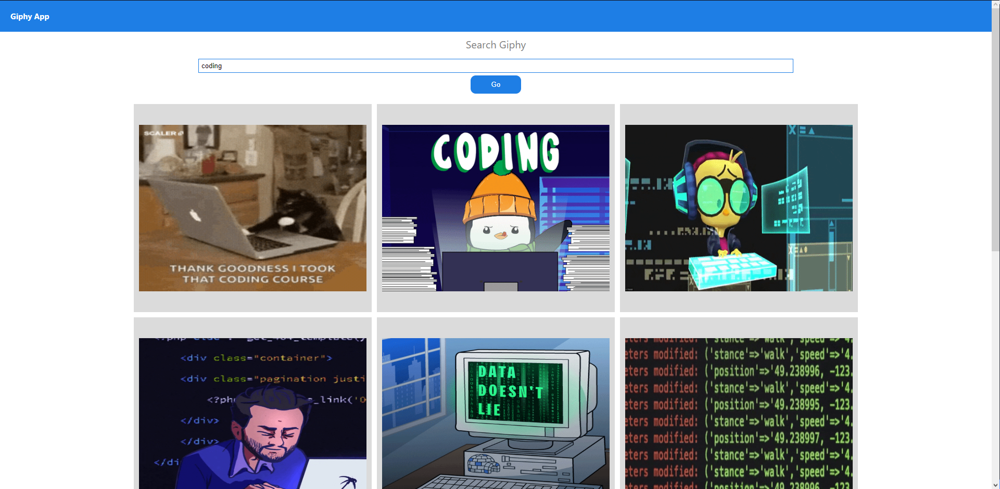

<!-- PROJECT LOGO -->

  <h1 align="center">Giphy app</h1>

  <h3 align="center">
   Search your favorite gifs
  </h3>
  
 
 ### Click here for live demo   <a href="https://mygyph.netlify.app">Giphy</a>

<!-- ABOUT THE PROJECT -->

## About The Project:

### Homepage:

On the homepage the user can search the gifs

#### The common funtionalities are:

- The user can search all the gifs available in database

I'm using [Giphy ](https://developers.giphy.com/docs/api/) to get gifs.

##### Credit: Giphy

### Built With

- #### React
- #### Materialize
- #### Giphy

### Key concepts:

- #### React components
- #### React state and props
- #### React hooks
- #### Materialize CSS
- #### Fetching data from an API
- #### Handling events
- #### String manipulation
- #### Filtering data
- #### JavaScript Object Oriented Programming

<!-- GETTING STARTED -->

# Getting Started

This project was bootstrapped with [Create React App](https://github.com/facebook/create-react-app).

## Available Scripts

### To run project:

### `npm start`

### To build project:

### `npm run build`
